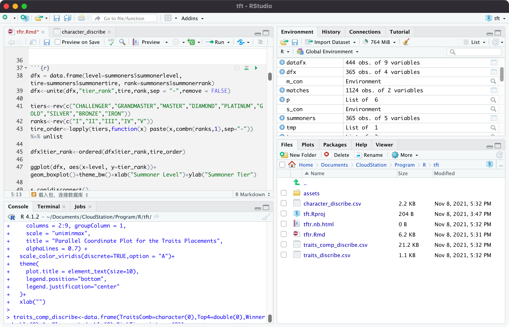
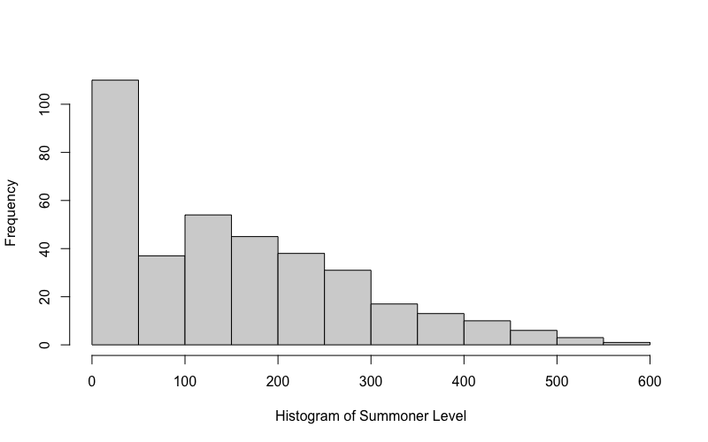
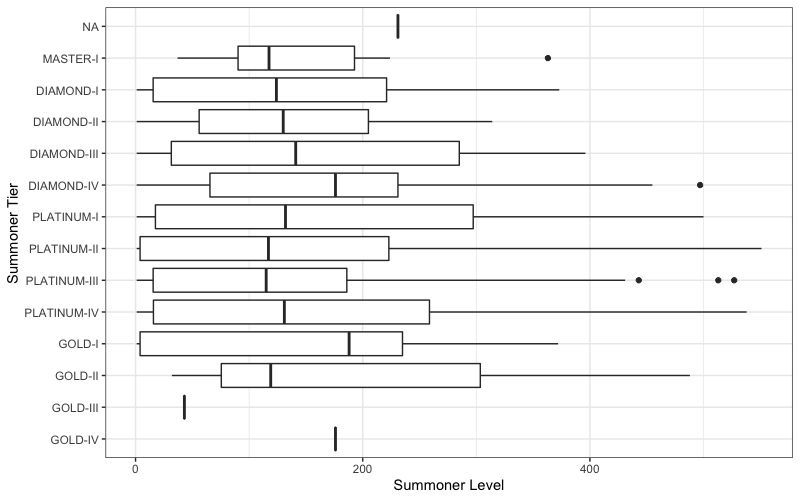
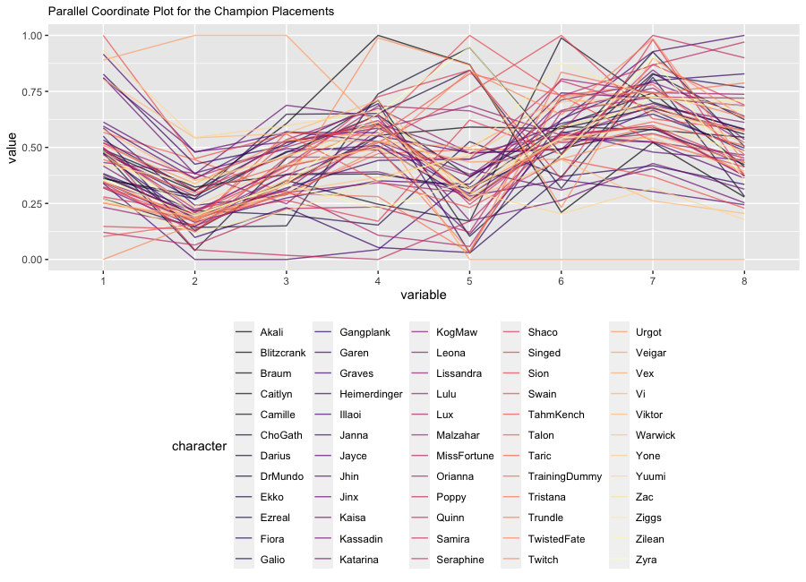
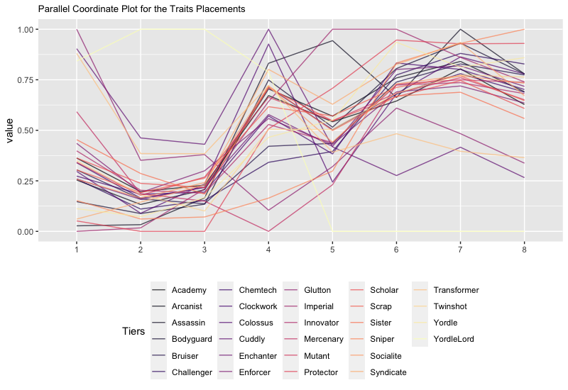
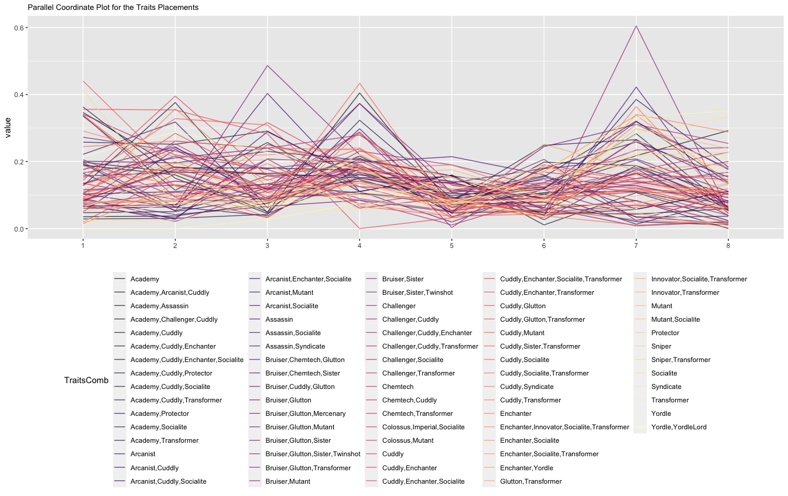

# tft collection and analysis

a simple cawler for Teamfight Tactics with Go and

a simple analysis with R

## Usage

Rename `.env.template` to `.env` and fill `YOUR Enveriment variables` in,

Then run `go build -o main ./cmd/collect/main.go`

And `./main`

Open`./R/tftr.Rmd` or [R Notebook](https://magicwenli.github.io/tft-collection-and-analysis/R/tftr.nb.html) find more!

-----

## Riot’s API

Riot Games, creators and owners of Teamfight Tactics, have provided a
semi-open API for gathering data for TFT. The API has frequency limits,
which is 20 requests every 1 seconds and 100 requests every 2 minutes
maximum. The following are frequently used APIs:

1.  `/tft/match/v1/matches`: According to the match ID, return the
    result of the game includes the participants and the
    ranking.\[api:matches\]

2.  `/tft/match/v1/matches/by-puuid`: According to the Puuid, return the
    recent match
    records.\[api:matchpuuid\]

3.  `/tft/summoner/v1/summoners/by-puuid`: According to the Puuid,
    return a data structure containing the information of the
    summoner.\[api:summpuuid\]

## Data collection

As TFT is operated globally, Riot’s api is divided into 11 platforms or
3 regions. Taking the North American server as an example, the data
gathering process of the API was as follow.

**Step 1**: Obtain the current Challenger rank summoner information from
API `/tft/league/v1/challenger`, and then query the game records
according API [\[api:matchpuuid\]](#api:matchpuuid) with returned Puuid.
Then select one of the match records as the starting point.

The purpose of this step is to obtain the match ID of the
challenger-rank player. From here on, the records we dig are biased
towards high-rank players.

**Step 2**: Get the data of the match from the
API [\[api:matches\]](#api:matches) and save the data to Mongodb. The
match information includes contest participants.

**Step 3**: Use the participants’ Puuid to obtain the player’s match
records through the API [\[api:matchpuuid\]](#api:matchpuuid). Save
participants’ information, then go back to the **Step 2** with match ID.

Starting from the **Step 3**, a loop is entered. We can get 8 matches
data at a time.

By writing the Go program, we coll 1216 match data and 447 player data.

## Data processing

After collecting information from Riot API and saving it to the
database, we use R language to assist in analyzing statistical
information. And we use RStudio is used as an IDE tool, which can
simplify the process of using R language and provide great convenience
for analysis work.

### Frequency histogram

The frequency histogram represents the frequency of the corresponding
group through the height of the rectangle. It can clearly show the
frequency distribution of each group, and it is easy to show the
difference in frequency. We will use it to observe some distribution of
summoner levels.

### Box plot

A box plot is a statistical chart used to display a set of data
dispersion information. The spacings between the different parts of the
box indicate the degree of dispersion (spread) and skewness in the data,
and show outliers. In addition to the points themselves, they allow one
to visually estimate various L-estimators, notably the interquartile
range, midhinge, range, mid-range, and trimean. We will use it to
analyze the relationship between the summoner’s rank tier and the game
time (positively correlated with the summoner level).

### Parallel coordinates plot

Parallel coordinates are a common way of visualizing and analyzing
high-dimensional datasets. To show a set of points in an n-dimensional
space, a backdrop is drawn consisting of n parallel lines, typically
vertical and equally spaced.This visualization is closely related to
time series visualization, except that it is applied to data where the
axes do not correspond to points in time, and therefore do not have a
natural order. We will use it to analyze the winning percentage rankings
of different champions and traits, and the combinations of traits.

## Result & Discuss

After collecting 1124 match data and 365 summoner informations, we can
propose analysis goals and conduct research. Although the amount of data
is not too much, we have selected higher-level players in the data
collection stage, which improves the reliability of the conclusion to a
certain extent.

### Summoner level

Frequency histogram of summoner information shown in
Figure [2](#fig:summonerlevel) and statistic shown in
Table [1](#tab:level).

Among the collected players, the number of players below level 50 is
many (30.1%). After removing this part, the level conforms to the
long-tailed distribution with a mean value of 153. This fits the
intuitive impression.

| Statistic |  N   |  Mean   | Min  | Pctl(25) | Pctl(75) | Max  |
| :-------: | :--: | :-----: | :--: | :------: | :------: | :--: |
|   Level   | 365  | 153.000 |  1   |    32    |   235    | 551  |

Summoner Level Statistic

### Summoner rank tiers

Another interesting point is to analyze the relationship between the
player’s rank and their game level.

By analyzing the box diagram shown in
Figure [3](#fig:level-tire-distribution), we found that game level and
rank are almost irrelevant. At the lower levels (GOLD-II to DIAMOND-IV),
the player level spans more extensively (from 0 to 420). The player
levels of the highest level like MASTER-1 are all between 30 and 250,
which is relatively more shrinking.

### Champions

In order to illustrate which champions have the strongest dominance in
TFT, we extracted each player’s champion selection from the game data,
and recorded the final ranking of the player. After statistics, this
information is made into a statistical table (Appendix
Table [\[ape:champions\]](#ape:champions)). Combining the information
in the table, a parallel coordinates graph is obtained in
Figure [4](#fig:champion-placement).

In this image, the calculation formula of the y-axis value is as
follows:

\[value = \frac{frequency-\min(frequency)}{\max(frequency)-\min(frequency)}\]

This means that the higher the value, the higher the player’s intention
to select the champion, and the x-axis also reflects the result of the
selection, placement.

Although the graph becomes complicated due to too many champions, we
still know that a few champions have a very high championship rate, and
the probability of most champions getting the top 4 seats is lower than
that of the bottom 4 seats.

| Index | Champion  | Top4  | Winner | AvgPlacement |
| :---- | :-------- | :---- | :----- | :----------- |
| 60    | Veigar    | 0.78  | 0.19   | 3.1          |
| 11    | Yuumi     | 0.658 | 0.196  | 3.651        |
| 27    | Viktor    | 0.638 | 0.177  | 3.76         |
| 5     | Jayce     | 0.632 | 0.194  | 3.77         |
| 13    | TahmKench | 0.621 | 0.206  | 3.771        |
| 41    | Kaisa     | 0.616 | 0.178  | 3.928        |

Champion Placement sorted by Top4 and
Winner\[tab:top4\]

| Index | Champion  | Top4  | Winner | AvgPlacement |
| :---- | :-------- | :---- | :----- | :----------- |
| 13    | TahmKench | 0.621 | 0.206  | 3.771        |
| 11    | Yuumi     | 0.658 | 0.196  | 3.651        |
| 5     | Jayce     | 0.632 | 0.194  | 3.77         |
| 60    | Veigar    | 0.78  | 0.19   | 3.1          |
| 6     | Galio     | 0.611 | 0.18   | 3.951        |
| 12    | Jinx      | 0.613 | 0.178  | 3.868        |

In a more detailed analysis, some champions appear to be particularly
dominant. The champions appearing at the forefront of the statistical
table are all high-cost champions. On the one hand, it shows that
high-cost champions can realize their value. On the other hand, it shows
that only players with more economic resources can enter the top 4.

One example is Veigar, which requires players to have all 3-star Yordle
champions to appear, which is undoubtedly extremely demanding. And when
the players gathered these elements and survive, the game has entered
the late stage. The players who can successfully pass the filter are
undoubtedly both luck and intelligent, which in turn illustrates the
dominance of Veigar.

### Traits

Fetters and champions have similar conclusions. Through
Figure [5](#fig:traits-placement), we can find that players are very
easy to fall into the bottom 4 when trying some fetters.

| Index | Traits    | Top4  | Winner | AvgPlacement |
| :---- | :-------- | :---- | :----- | :----------- |
| 27    | Protector | 0.444 | 0.107  | 4.775        |
| 26    | Sniper    | 0.461 | 0.117  | 4.725        |
| 22    | Imperial  | 0.462 | 0.101  | 4.655        |
| 25    | Assassin  | 0.469 | 0.104  | 4.659        |
| 24    | Yordle    | 0.474 | 0.113  | 4.632        |
| 2     | Bodyguard | 0.486 | 0.117  | 4.585        |

Traits Placement sorted by Top4 (Reverse
order)\[tab:traittop4\]

Check the fetters that are the most difficult to enter the top 4
(Table [3](#tab:traittop4)):

  - Protector, only defensive power, lack of initiative, slow forming
    speed.

  - Sniper, relying on the protection provided by equipment and other
    champions, all members of the fetters are DPS, and there is not
    enough diversity.

  - Imperial, the special effects of fetters are to enhance the attack
    power of the members, because the numerical design is conservative,
    which leads to relatively weak.

  - Assassin, same as the sniper, it’s not easy to incorporate tanks
    into the fetters construction.

  - Yordle, although Vega is strong, other members may not pass the test
    before calling him.

But in this version, there are some fetters that are worthy of active
use.

  - Enforcer

  - Scholar

  - Academy

  - Mutant

  - Innovator

  - Mercenary

They all have a probability of greater than 50% to enter the top 4, and
they are all the fetters of a relatively large number of members, which
means that the intermediate stage is easy to transition.

### Trait Combinations

The fun of TFT lies in the richness of the game lineup. In this
thousands matches, more than 3000 different lineups have been counted.
After filtering out those games that only completed 1 or 2 traits (which
means that the player basically did nothing\!), we still got 444 bond
combinations that can be used for analysis.

| Index | TraitsComb                                            | Top4 | Winner | AvgPlacement |
| :---- | :---------------------------------------------------- | :--- | :----- | :----------- |
| 422   | Cuddly, Enforcer, Glutton, Sister, Transformer        | 1    | 0.667  | 1.333        |
| 433   | Bruiser, Cuddly, Glutton, Mercenary                   | 1    | 0.667  | 1.333        |
| 178   | Enchanter, Innovator, Scholar, Socialite, Transformer | 1    | 0.75   | 1.5          |
| 199   | Cuddly, Innovator, Sister, Transformer                | 1    | 0.625  | 1.5          |
| 371   | Bruiser, Colossus, Glutton, Mutant                    | 1    | 0.8    | 1.6          |
| 259   | Academy, Challenger, Cuddly, Enchanter                | 1    | 0.667  | 1.667        |
| 283   | Cuddly, Enchanter, Scholar, Socialite, Transformer    | 1    | 0.333  | 1.667        |
| 402   | Academy, Challenger, Cuddly, Socialite, Transformer   | 1    | 0.333  | 1.667        |

These fetters are compatible, easy to combine and transition. Some of
them are more complicated and difficult to operate. For example,
`Cuddly, Innovator, Sister, Transformer` is high prices, and only
high-level stores will provide the members. But you can still use the
statistical results as a game reference. Detailed fetters can be found
in the table in the appendix.